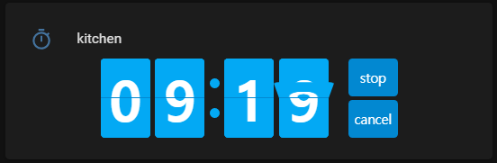

# Flipdown Timer Card

Card for timer entities in the Lovelace user interface of Home Assistant


## Features

- Set timer duration on the card
- Display timer
- Flip together if you have multiple cards

## Installation

- Install using HACS and add this card.
- Or Download the 'flipdown-timer-card.js' from the latest release.

## Configuration

| Name       | Type    | Requirement  | Description                                              | Default |
| ---------- | ------- | ------------ | -------------------------------------------------------- | ------- |
| type       | string  | **Required** | `custom:flipdown-timer-card`                             |         |
| entity     | string  | **Required** | Timer entity                                             |         |
| duration   | string  | **Optional** | Timer duration indicated when idle. Should be 'hh:mm:ss' |         |
| theme      | string  | **Optional** | Colorscheme : hass, dark, light                          | `hass`  |
| show_title | boolean | **Optional** | Show card title                                          | `false` |
| show_hours | boolean | **Optional** | Show hour rotors                                         | `false` |
| styles     | object  | **Optional** | Card style                                               |         |

Home Assistant timer updates default duration whenever timer starts. if duration is set on this card, it will override default timer duration when idle.

## Styles Object

<table>
<thead>
<tr>
<th>Object</th>
<th>key</th>
<th>Description</th>
<th>Default</th>
</tr>
</thead>
<tbody>
<tr>
<td rowspan=2>rotor</td>
<td>width</td>
<td>single rotor width</td>
<td>50px</td>
</tr>
<tr>
<td>height</td>
<td>single rotor height</td>
<td>80px</td>
</tr>
<tr>
<td rowspan=2>button</td>
<td>width</td>
<td>button width</td>
<td>50px</td>
</tr>
<tr>
<td>location</td>
<td>button location - right, bottom, hide</td>
<td>right</td>
</tr>
</tbody>
</table>
## Example

```yaml
- type: custom:flipdown-timer-card
  entity: timer.timer
  show_hour: false
  show_title: false
  theme: dark
  duration: '00:00:00'
  styles:
    rotor:
      width: 60px
      height: 80px
    button:
      width: 60px
      location: bottom
```

## Notes

- Timing error(<1s) may occur due to flipping effect.

## Credits

- This card is based on the work of [@PButcher/flipdown](https://github.com/PButcher/flipdown)
- and [@iantrich](https://github.com/iantrich)'s boilerplate card
